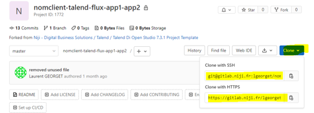
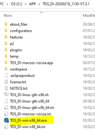
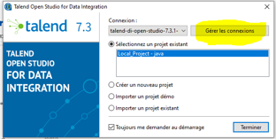
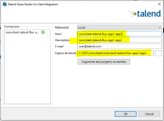
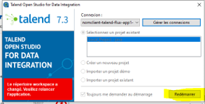
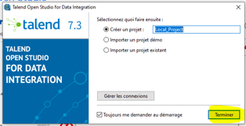

# Cloner et utiliser le projet localement

L'arborescence suivante est préconisée :

```txt
├───APP
│   ├───TOS_DI-20170623_1246-V6.4.1
│   ├───TOS_DI-20181026_1147-V7.1.1
│   ├───TOS_DI-20190620_1446-V7.2.1
│   └───TOS_DI-20200219_1130-V7.3.1
└───DEV
    ├───nomclient1
    │   └───nomclient1-talend-flux-sf-akuiteo
    └───nomclient2
        └───nomclient2-talend-flux-sf-sap
```

Afin de travailler sur votre poste local, vous avez deux options :
- Utiliser _git bash_ en ligne de commande (https://git-scm.com/downloads)
  - Tous les exemples seront en ligne de commande
- Utiliser un outil graphique comme _sourcetree_ (https://www.sourcetreeapp.com/)

## Cloner le projet sur son poste (la première fois)



```bash
$ mkdir nomclient

$ cd nomclient

$ git clone https://gitlab.niji.fr/lgeorget/nomclient-talend-flux-app1-app2.git
```

## Ouvrir le projet sur son poste

- Lancer la bonne version de Talend



- Changer de workspace



- Donner un nom de workspace identifiable (1 projet git = 1 workspace)



- Redémarrer Talend



- Curieusement, le projet n'est pas reconnu. Ne pas s'inquiéter : laisser le nom par défaut et terminer



## Utilisation des commandes git

Je ne décrirais la gestion des branches. Le workflow Niji DBS est git flow.

Il est impératif de réaliser un commit à chaque état stable de son développement (à minima une fois par jour). Ces commits doivent être poussés dans gitlab afin de permettre des revues de code.

```bash
$ git add -A

$ git commit -m "description commit"

$ git push
```