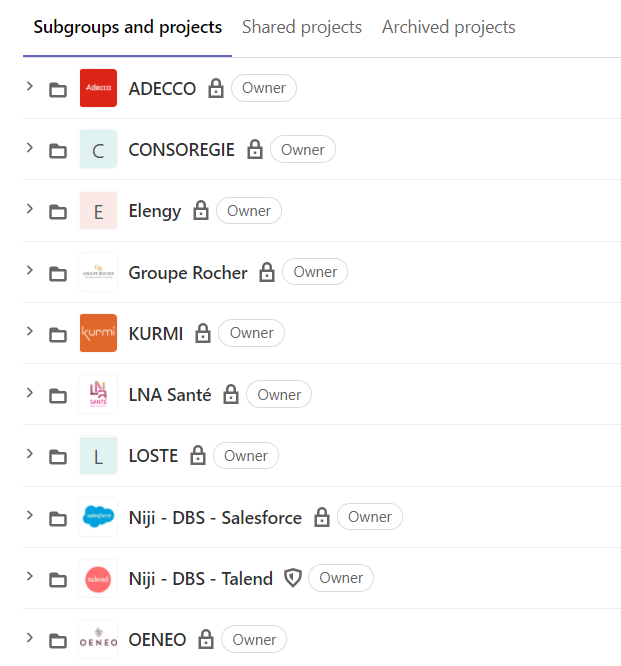
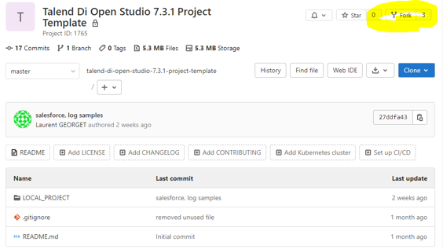
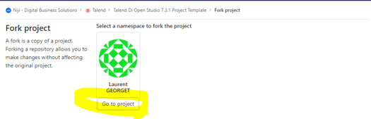
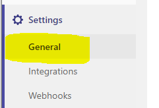
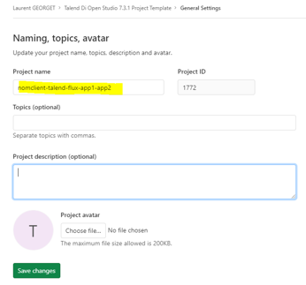
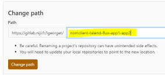

# Créer un nouveau projet à parti du modèle

## Vérifier que vous avez bien un groupe au nom de votre client

- Il est nécessaire de bien vérifier que vous avez accès à un groupe privé au nom de votre client et ne pas travailler sur votre espace de travail privé.

## Ouvrir le modèle de projet

- Se connecter au GitLab Niji et accéder au modèle de projet
    - https://gitlab.niji.fr/niji-digital-business-solutions/talend/talend-di-open-studio-7.3.1-project-template

## Forker le modèle de projet

- Cliquer sur le bouton "Fork" 

- Sélectionner votre espace

Veuillez bien choisir un groupe au nom de votre client (et non votre namespace comme indiqué sur la capture)

Le processus dure quelques secondes

- Modifier les propriétés de votre projet

- Modifier les propriétés de votre projet : Son nom

- Modifier les propriétés de votre projet : Son chemin

**Bravo**