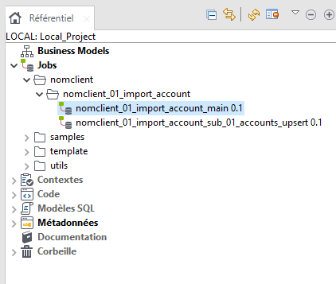

# Importer un ancien projet

Si vous reprenez un projet existant qui n'était pas dans git, alors cette rubrique est pour vous.

Je conseille de toujours partir du modèle de projet et d'importer les éléments des anciennes sources. Vous pourrez ensuite les supprimer.

## Créer un dossier

- Il est préconisé de créer un dossier au nom du client.

## Importer des éléments

Dans le référentiel (cf image précédente), faites Clic droit -> Importer des éléments

